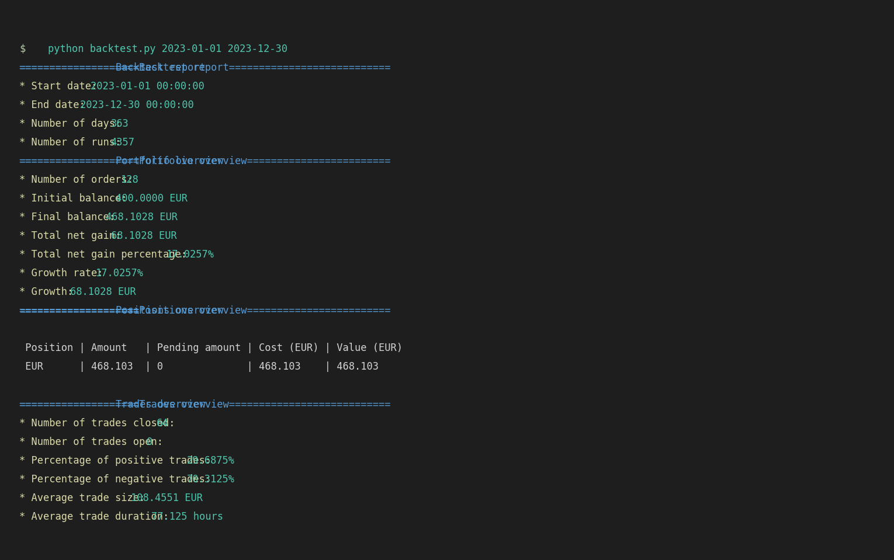
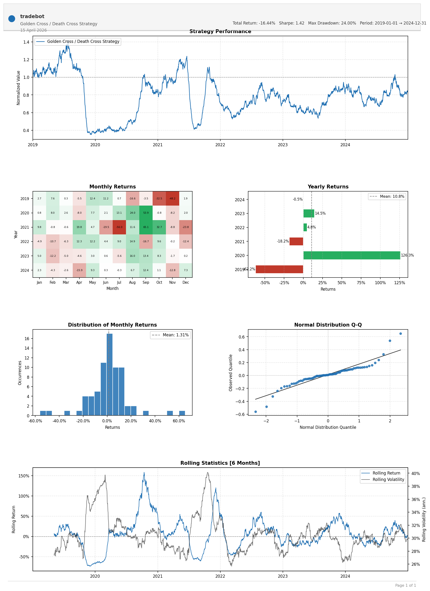
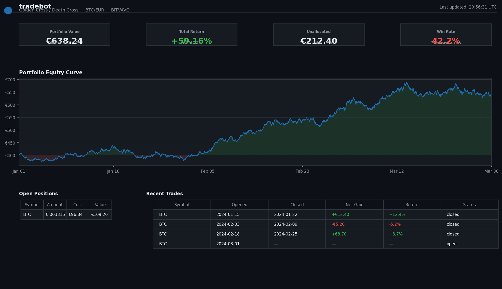

<div align="center">
  <h1>🤖 tradebot</h1>
  <p>
    An automated cryptocurrency trading bot implementing a Golden Cross / Death Cross
    strategy on BTC/EUR, built with the
    <a href="https://github.com/coding-kitties/investing-algorithm-framework">investing-algorithm-framework v8</a>.
  </p>
  <p>
    
    
    
    
  </p>
</div>

---

## Table of Contents

1. [Overview](#overview)
2. [Strategy](#strategy)
3. [Project Structure](#project-structure)
4. [Prerequisites](#prerequisites)
5. [Step 1 – Install Dependencies](#step-1--install-dependencies)
6. [Step 2 – Configure the App](#step-2--configure-the-app)
7. [Step 3 – Backtest the Strategy](#step-3--backtest-the-strategy)
8. [Step 4 – Analyse the Backtest Results](#step-4--analyse-the-backtest-results)
9. [Step 5 – Deploy the Trading Bot](#step-5--deploy-the-trading-bot)
10. [Step 6 – Live Dashboard](#step-6--live-dashboard)
11. [Configuration Reference](#configuration-reference)

---

## Overview

**tradebot** buys and sells Bitcoin automatically by detecting when short-term
momentum (9-period SMA) crosses the long-term trend (50-period SMA) on
2-hour candles.  The full workflow is:

```
Download OHLCV data → Run backtest → Review charts → Deploy to cloud → Monitor live
```

---

## Strategy

| Signal | Condition |
|--------|-----------|
| **Buy** (Golden Cross) | Fast SMA (9) crosses **above** Slow SMA (50) |
| **Sell** (Death Cross) | Fast SMA (9) crosses **below** Slow SMA (50) |

Each buy order allocates **25 %** of the available portfolio balance.
The strategy runs every **2 hours** on BTC/EUR data from [Bitvavo](https://bitvavo.com).

---

## Project Structure

```
tradebot/
├── app.py              # App factory – registers data providers and strategy
├── strategy.py         # Golden Cross / Death Cross trading strategy
├── backtest.py         # Step 3 – Run a historical backtest (CLI)
├── plot.py             # Step 4 – Generate QF-Lib-style performance charts
├── azure_function.py   # Step 5 – Azure Functions timer-trigger deployment
├── dashboard.py        # Step 6 – Live real-time monitoring dashboard
└── docs/
    └── images/         # Sample output images embedded in this README
```

---

## Prerequisites

- Python 3.10 or later
- A [Bitvavo](https://bitvavo.com) account with API access (for live trading only)
- Azure subscription (for cloud deployment only)

---

## Step 1 – Install Dependencies

```bash
pip install investing-algorithm-framework tulipy \
            matplotlib scipy \
            dash plotly flask
```

---

## Step 2 – Configure the App

`app.py` wires together the data providers and the strategy:

```python
from investing_algorithm_framework import create_app, CCXTOHLCVDataProvider, \
    CCXTTickerDataProvider
from strategy import GoldenCrossDeathCrossTradingStrategy

app = create_app()
app.add_data_provider(CCXTOHLCVDataProvider(
    symbol="BTC/EUR", market="BITVAVO",
    time_frame="2h", window_size=204,
))
app.add_data_provider(CCXTTickerDataProvider(
    symbol="BTC/EUR", market="BITVAVO",
))
app.add_strategy(GoldenCrossDeathCrossTradingStrategy)
```

---

## Step 3 – Backtest the Strategy

Run a historical backtest over any date range:

```bash
python backtest.py <start_date> <end_date>
```

**Example:**

```bash
python backtest.py 2023-01-01 2023-12-30
```

The framework replays every 2-hour candle in the date range, executes buy/sell
orders according to the strategy signals, and prints a detailed report to the
terminal:



The report shows:
- **Backtest report** – period, number of runs, order count
- **Portfolio overview** – initial/final balance, total net gain, growth rate
- **Positions overview** – amounts, costs, values
- **Trades overview** – win rate, average size, average duration

---

## Step 4 – Analyse the Backtest Results

Generate a professional performance report (saved as `backtest_report.png`):

```bash
python plot.py 2023-01-01 2023-12-30
```

The report contains six panels that match the industry-standard QF-Lib style:



| Panel | Description |
|-------|-------------|
| **Strategy Performance** | Normalised equity curve starting at 1.0 |
| **Monthly Returns** | Colour-coded heatmap (green = gain, red = loss) with % values in each cell |
| **Yearly Returns** | Horizontal bar chart per calendar year with a dashed mean line |
| **Distribution of Monthly Returns** | Histogram with a dashed mean marker |
| **Normal Distribution Q-Q** | Quantile plot to assess return normality |
| **Rolling Statistics [6 Months]** | Rolling 6-month return (blue) and annualised volatility (dark) |

The report is also importable from other scripts:

```python
from plot import plot_backtest
plot_backtest(backtest, output_path="my_report.png",
              strategy_name="My Strategy")
```

---

## Step 5 – Deploy the Trading Bot

Once you have found a profitable strategy, deploy it to **Azure Functions**
as a timer-triggered function that runs every 2 hours.

### Setup

1. Copy `azure_function.py` into your Azure Functions project.
2. Set the following **application settings** (environment variables):

   | Variable | Description |
   |----------|-------------|
   | `BITVAVO_API_KEY` | Your Bitvavo API key |
   | `BITVAVO_SECRET_KEY` | Your Bitvavo secret key |

3. Set them locally for testing:

   ```bash
   export BITVAVO_API_KEY=your_api_key
   export BITVAVO_SECRET_KEY=your_secret_key
   ```

4. Deploy with the Azure Functions Core Tools:

   ```bash
   func azure functionapp publish <YOUR_FUNCTION_APP_NAME>
   ```

The function runs on the cron schedule `0 */2 * * * *` (every 2 hours):

```python
@app.timer_trigger(schedule="0 */2 * * * *", arg_name="myTimer",
                   run_on_startup=True, use_monitor=False)
def trading_bot_azure_function(myTimer: func.TimerRequest) -> None:
    trading_bot_app.run(
        payload={"ACTION": StatelessAction.RUN_STRATEGY.value}
    )
```

---

## Step 6 – Live Dashboard

Monitor portfolio performance, open positions, and recent trades in real time
from a browser.

### Start the dashboard

```bash
python dashboard.py
```

Then open **http://127.0.0.1:8050** in your browser.



The dashboard provides:
- **KPI cards** – current portfolio value, total return, available cash, win rate
- **Equity curve** – portfolio value over time with fill above/below baseline
- **Open positions** – symbol, amount held, cost basis, current value
- **Recent trades** – entry/exit dates, net gain (colour-coded green/red), return %, status

> **Auto-refresh**: the page polls for new data every 30 seconds automatically.
> Set the `DATABASE_PATH` environment variable if your bot stores its SQLite
> database in a custom location.

---

## Configuration Reference

| Parameter | File | Default | Description |
|-----------|------|---------|-------------|
| `market` | `app.py` | `BITVAVO` | Exchange identifier (CCXT name) |
| `symbol` | `app.py` | `BTC/EUR` | Trading pair |
| `time_frame` | `app.py` | `2h` | OHLCV candle interval |
| `window_size` | `app.py` | `204` | Lookback candles (~17 days) |
| `initial_balance` | `backtest.py` | `400` | Starting capital (EUR) |
| `percentage_of_portfolio` | `strategy.py` | `25` | Portfolio % per buy order |
| `fast_period` | `strategy.py` | `9` | Fast SMA period |
| `slow_period` | `strategy.py` | `50` | Slow SMA period |
| `POLL_INTERVAL_MS` | `dashboard.py` | `30000` | Dashboard refresh interval (ms) |
| `PORT` | `dashboard.py` | `8050` | Dashboard HTTP port |
| `DATABASE_PATH` | `dashboard.py` | `bot_state.db` | Path to the bot's SQLite database |

