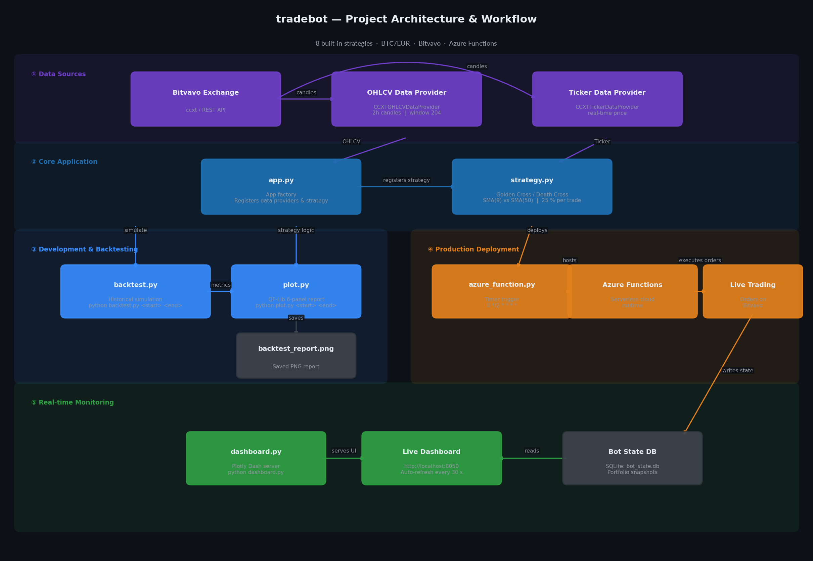
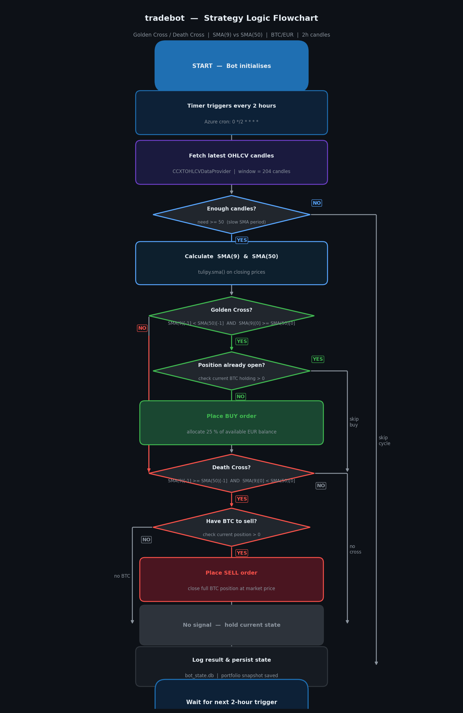

<div align="center">
  <h1>🤖 tradebot</h1>
  <p>
    An automated cryptocurrency trading bot with five built-in strategies,
    built with the
    <a href="https://github.com/coding-kitties/investing-algorithm-framework">investing-algorithm-framework v8</a>
    and a public interactive backtest dashboard deployable to Render or Railway in minutes.
  </p>
  <p>
    
    
    
    
  </p>
</div>

---

## Table of Contents

1. [Overview](#overview)
2. [Strategies](#strategies)
3. [Project Structure](#project-structure)
4. [Prerequisites](#prerequisites)
5. [Step 1 – Install Dependencies](#step-1--install-dependencies)
6. [Step 2 – Configure the App](#step-2--configure-the-app)
7. [Step 3 – Backtest the Strategy](#step-3--backtest-the-strategy)
8. [Step 4 – Analyse the Backtest Results](#step-4--analyse-the-backtest-results)
9. [Step 5 – Deploy the Trading Bot](#step-5--deploy-the-trading-bot)
10. [Step 6 – Live Dashboard](#step-6--live-dashboard)
    - [6.1 How the Dashboard Works](#61-how-the-dashboard-works)
    - [6.2 Prerequisites](#62-prerequisites)
    - [6.3 Install Dashboard Dependencies](#63-install-dashboard-dependencies)
    - [6.4 Set the Database Path](#64-set-the-database-path)
    - [6.5 Start the Dashboard](#65-start-the-dashboard)
    - [6.6 Dashboard Panels Explained](#66-dashboard-panels-explained)
    - [6.7 Customise the Dashboard](#67-customise-the-dashboard)
    - [6.8 Run Dashboard & Bot Together](#68-run-dashboard--bot-together)
    - [6.9 Deploy Dashboard to a Server](#69-deploy-dashboard-to-a-server)
    - [6.10 Troubleshooting](#610-troubleshooting)
11. [Step 7 – Interactive Public Backtest Dashboard](#step-7--interactive-public-backtest-dashboard)
    - [7.1 What It Does](#71-what-it-does)
    - [7.2 Run Locally](#72-run-locally)
    - [7.3 Deploy to Render (Free)](#73-deploy-to-render-free)
    - [7.4 Deploy to Railway (Free)](#74-deploy-to-railway-free)
    - [7.5 Supported Strategies & Parameters](#75-supported-strategies--parameters)
12. [Configuration Reference](#configuration-reference)

---

## Overview

**tradebot** buys and sells Bitcoin automatically by detecting when short-term
momentum (9-period SMA) crosses the long-term trend (50-period SMA) on
2-hour candles.

### Architecture & Workflow



The full pipeline runs in five phases:

| Phase | Description |
|-------|-------------|
| **① Data Sources** | Bitvavo exchange provides 2-hour OHLCV candles and real-time ticker via CCXT |
| **② Core Application** | `app.py` wires the data providers together; `strategy.py` implements the SMA crossover logic |
| **③ Development** | `backtest.py` replays history; `plot.py` saves a QF-Lib-style 6-panel report |
| **④ Production** | `azure_function.py` deploys the bot as a serverless Azure Functions timer trigger |
| **⑤ Monitoring** | `dashboard.py` serves a live Plotly Dash UI that reads the bot's SQLite state database |

### Strategy Logic Flowchart

The diagram below shows exactly how `strategy.py` evaluates each 2-hour candle and decides whether to buy, sell, or hold.



| Decision point | Condition | Outcome |
|----------------|-----------|---------|
| **Enough candles?** | window has ≥ 50 bars (slow SMA period) | YES → compute SMAs, NO → skip cycle |
| **Golden Cross** | SMA(9) crosses **above** SMA(50) | YES + no position → **BUY** 25 % of balance |
| **Death Cross** | SMA(9) crosses **below** SMA(50) | YES + position open → **SELL** full holding |
| **No signal** | Neither crossover detected | Hold current state, wait for next trigger |

---

## Strategies

The project ships five ready-to-use strategies, all living in the `strategies/` package.
Each strategy follows the same interface so you can swap them in `app.py` with a single line.

| Strategy | File | Signal – Buy | Signal – Sell | Key params |
|---|---|---|---|---|
| **Golden Cross / Death Cross** | `strategies/golden_cross.py` | Fast SMA(9) crosses above Slow SMA(50) | Fast SMA crosses below Slow SMA | `fast=9`, `slow=50` |
| **RSI Reversion** | `strategies/rsi_strategy.py` | RSI(14) falls below 30 (oversold) | RSI(14) rises above 70 (overbought) | `period=14`, `oversold=30`, `overbought=70` |
| **MACD Signal Cross** | `strategies/macd_strategy.py` | MACD line crosses above Signal line | MACD line crosses below Signal line | `fast=12`, `slow=26`, `signal=9` |
| **Bollinger Bands** | `strategies/bollinger_strategy.py` | Close touches or falls below lower band | Close touches or rises above upper band | `period=20`, `stddev=2.0` |
| **EMA Crossover** | `strategies/ema_cross.py` | Fast EMA(9) crosses above Slow EMA(21) | Fast EMA(9) crosses below Slow EMA(21) | `fast=9`, `slow=21` |

### Switching strategies in `app.py`

```python
# Use any strategy by importing from the strategies package
from strategies import RSIReversionTradingStrategy   # or any other

app.add_strategy(RSIReversionTradingStrategy)
```

---

## Project Structure

```
tradebot/
├── strategies/                     # Trading strategy library
│   ├── __init__.py                 # Exports all five strategies
│   ├── golden_cross.py             # SMA 9/50 crossover (original)
│   ├── rsi_strategy.py             # RSI-14 mean reversion
│   ├── macd_strategy.py            # MACD signal-line cross
│   ├── bollinger_strategy.py       # Bollinger Bands touch
│   └── ema_cross.py                # EMA 9/21 crossover
│
├── app.py                          # App factory – registers data providers and strategy
├── strategy.py                     # Original strategy (kept for backward compatibility)
├── backtest.py                     # Step 3 – Run a historical backtest (CLI)
├── plot.py                         # Step 4 – Generate QF-Lib-style performance charts
├── azure_function.py               # Step 5 – Azure Functions timer-trigger deployment
├── dashboard.py                    # Step 6 – Live real-time monitoring dashboard
├── backtest_dashboard.py           # Step 7 – Interactive public backtest dashboard
│
├── render.yaml                     # Render.com deployment config
├── Procfile                        # Railway / Heroku deployment hook
├── requirements-dashboard.txt      # Dashboard-only dependencies
└── docs/
    └── images/                     # Sample output images embedded in this README
```

---

## Prerequisites

- Python 3.10 or later
- A [Bitvavo](https://bitvavo.com) account with API access (for live trading only)
- Azure subscription (for cloud deployment only)

---

## Step 1 – Install Dependencies

```bash
pip install investing-algorithm-framework tulipy \
            matplotlib scipy \
            dash plotly flask
```

---

## Step 2 – Configure the App

`app.py` wires together the data providers and the strategy:

```python
from investing_algorithm_framework import create_app, CCXTOHLCVDataProvider, \
    CCXTTickerDataProvider
from strategy import GoldenCrossDeathCrossTradingStrategy

app = create_app()
app.add_data_provider(CCXTOHLCVDataProvider(
    symbol="BTC/EUR", market="BITVAVO",
    time_frame="2h", window_size=204,
))
app.add_data_provider(CCXTTickerDataProvider(
    symbol="BTC/EUR", market="BITVAVO",
))
app.add_strategy(GoldenCrossDeathCrossTradingStrategy)
```

---

## Step 3 – Backtest the Strategy

Run a historical backtest over any date range:

```bash
python backtest.py <start_date> <end_date>
```

**Example:**

```bash
python backtest.py 2023-01-01 2023-12-30
```

The framework replays every 2-hour candle in the date range, executes buy/sell
orders according to the strategy signals, and prints a detailed report to the
terminal:


The report shows:
- **Backtest report** – period, number of runs, order count
- **Portfolio overview** – initial/final balance, total net gain, growth rate
- **Positions overview** – amounts, costs, values
- **Trades overview** – win rate, average size, average duration

---

## Step 4 – Analyse the Backtest Results

Generate a professional performance report (saved as `backtest_report.png`):

```bash
python plot.py 2023-01-01 2023-12-30
```

The report contains six panels that match the industry-standard QF-Lib style:


| Panel | Description |
|-------|-------------|
| **Strategy Performance** | Normalised equity curve starting at 1.0 |
| **Monthly Returns** | Colour-coded heatmap (green = gain, red = loss) with % values in each cell |
| **Yearly Returns** | Horizontal bar chart per calendar year with a dashed mean line |
| **Distribution of Monthly Returns** | Histogram with a dashed mean marker |
| **Normal Distribution Q-Q** | Quantile plot to assess return normality |
| **Rolling Statistics [6 Months]** | Rolling 6-month return (blue) and annualised volatility (dark) |

The report is also importable from other scripts:

```python
from plot import plot_backtest
plot_backtest(backtest, output_path="my_report.png",
              strategy_name="My Strategy")
```

---

## Step 5 – Deploy the Trading Bot

Once you have found a profitable strategy, deploy it to **Azure Functions**
as a timer-triggered function that runs every 2 hours.

### Setup

1. Copy `azure_function.py` into your Azure Functions project.
2. Set the following **application settings** (environment variables):

   | Variable | Description |
   |----------|-------------|
   | `BITVAVO_API_KEY` | Your Bitvavo API key |
   | `BITVAVO_SECRET_KEY` | Your Bitvavo secret key |

3. Set them locally for testing:

   ```bash
   export BITVAVO_API_KEY=your_api_key
   export BITVAVO_SECRET_KEY=your_secret_key
   ```

4. Deploy with the Azure Functions Core Tools:

   ```bash
   func azure functionapp publish <YOUR_FUNCTION_APP_NAME>
   ```

The function runs on the cron schedule `0 */2 * * * *` (every 2 hours):

```python
@app.timer_trigger(schedule="0 */2 * * * *", arg_name="myTimer",
                   run_on_startup=True, use_monitor=False)
def trading_bot_azure_function(myTimer: func.TimerRequest) -> None:
    trading_bot_app.run(
        payload={"ACTION": StatelessAction.RUN_STRATEGY.value}
    )
```

---

## Step 6 – Live Dashboard

Monitor portfolio performance, open positions, and recent trades in real time
from any browser.  The dashboard is a self-contained [Plotly Dash](https://dash.plotly.com/)
application (`dashboard.py`) that reads directly from the same SQLite database
written by the trading bot.


---

### 6.1 How the Dashboard Works

```
trading bot (azure_function.py / app.py)
        │  writes portfolio snapshots
        ▼
  bot_state.db  (SQLite)
        │  dashboard reads every 30 s
        ▼
  dashboard.py  (Plotly Dash server)
        │  serves HTTP
        ▼
  browser  →  http://127.0.0.1:8050
```

- The bot writes a portfolio snapshot to `bot_state.db` after every strategy run.
- `dashboard.py` connects to that database and queries the latest snapshot each time the browser polls.
- When no live database is found, the dashboard automatically enters **demo mode** so you can inspect the UI before the bot has run.

---

### 6.2 Prerequisites

| Requirement | Notes |
|-------------|-------|
| Python 3.10+ | same as the bot |
| `dashboard.py` | already in the repo root |
| `bot_state.db` | created automatically when the bot runs; dashboard works in demo mode without it |
| Port 8050 available | or set a custom port via the `PORT` environment variable |

---

### 6.3 Install Dashboard Dependencies

The dashboard requires **Dash**, **Plotly**, and **Flask** (Flask is pulled in automatically by Dash).

```bash
pip install dash plotly
```

If you installed all dependencies in Step 1 these are already present:

```bash
pip install investing-algorithm-framework tulipy \
            matplotlib scipy \
            dash plotly flask
```

Verify the installation:

```bash
python - <<'EOF'
import dash, plotly
print("dash", dash.__version__)
print("plotly", plotly.__version__)
EOF
```

---

### 6.4 Set the Database Path

By default `dashboard.py` looks for `bot_state.db` in the same directory as the script.

**Linux / macOS**

```bash
export DATABASE_PATH=/path/to/your/bot_state.db
```

**Windows (Command Prompt)**

```cmd
set DATABASE_PATH=C:\path\to\your\bot_state.db
```

**Windows (PowerShell)**

```powershell
$env:DATABASE_PATH = "C:\path\to\your\bot_state.db"
```

> Leave `DATABASE_PATH` unset to use the default path `./bot_state.db`.

---

### 6.5 Start the Dashboard

```bash
python dashboard.py
```

Expected output:

```
  tradebot live dashboard  ->  http://127.0.0.1:8050
```

Open **http://127.0.0.1:8050** in your browser.

To bind to a different port:

```bash
PORT=9000 python dashboard.py          # Linux / macOS
set PORT=9000 && python dashboard.py   # Windows CMD
```

To expose the dashboard on your local network (e.g. access from another device):

```bash
# dashboard.py already uses host="0.0.0.0"; just set the port
PORT=8050 python dashboard.py
# then open  http://<your-machine-ip>:8050  from any device on the same network
```

---

### 6.6 Dashboard Panels Explained

#### KPI Cards (top row)

| Card | Source | Description |
|------|--------|-------------|
| **Portfolio Value** | `portfolio.total_value` | Current total portfolio value in EUR |
| **Total Return** | calculated | `(current / initial − 1) × 100 %` with EUR delta |
| **Unallocated** | `portfolio.unallocated` | Cash available for new buy orders |
| **Win Rate** | `trade` table | Percentage of closed trades with `net_gain > 0` |

> In demo mode the Win Rate card is replaced with a **Status: Demo** card.

#### Portfolio Equity Curve

A time-series line chart of `portfolio_snapshot.total_value` ordered by `created_at`.
- Blue line = portfolio value over time
- Dotted grey line = initial balance baseline
- Fill above/below the baseline highlights gains (blue tint) and losses

#### Open Positions table

Reads `position WHERE amount > 0`.  Columns: Symbol, Amount, Cost (€), Value (€).

#### Recent Trades table

Reads the last 20 rows from the `trade` table ordered by `opened_at DESC`.
- **Net Gain** and **Return %** columns are colour-coded: green for profits, red for losses.
- Paginated at 10 rows per page.

#### Auto-refresh

The page polls for new data every **30 seconds** via a hidden `dcc.Interval` component.
The "Last updated" timestamp in the top-right corner updates on every refresh.

---

### 6.7 Customise the Dashboard

All tuneable constants are at the top of `dashboard.py`:

```python
POLL_INTERVAL_MS = 30_000   # refresh interval in milliseconds
PORT             = 8050     # HTTP port (overridden by $PORT env var)
DATABASE_PATH    = ...      # SQLite path (overridden by $DATABASE_PATH env var)
```

**Change refresh rate to 10 seconds:**

```python
POLL_INTERVAL_MS = 10_000
```

**Add a new KPI card** — extend the `kpis` list in the `refresh()` callback:

```python
kpis.append(_kpi_card("My Metric", "42", "description"))
```

**Change the colour theme** — edit the palette constants:

```python
ACCENT = "#1f6fb2"   # chart line / dot colour
BG     = "#0d1117"   # page background
CARD   = "#161b22"   # card background
BORDER = "#30363d"   # card / table border
```

---

### 6.8 Run Dashboard & Bot Together

Run the bot and the dashboard side-by-side so you can monitor results in real time.

**Option A — two terminal windows**

```bash
# Terminal 1 – run the bot (or let Azure Functions run it on schedule)
python app.py

# Terminal 2 – start the dashboard
python dashboard.py
```

**Option B — background process (Linux / macOS)**

```bash
python dashboard.py &
echo "Dashboard PID: $!"
```

**Option C — `screen` or `tmux`**

```bash
tmux new-session -d -s bot      'python app.py'
tmux new-session -d -s dash     'python dashboard.py'
tmux ls          # list sessions
tmux attach -t dash              # attach to dashboard session
```

---

### 6.9 Deploy Dashboard to a Server

To keep the dashboard available 24/7, deploy it alongside the bot on a cloud VM or VPS.

#### Systemd service (Linux)

1. Create `/etc/systemd/system/tradebot-dashboard.service`:

```ini
[Unit]
Description=tradebot live dashboard
After=network.target

[Service]
User=ubuntu
WorkingDirectory=/home/ubuntu/tradebot
Environment="DATABASE_PATH=/home/ubuntu/tradebot/bot_state.db"
Environment="PORT=8050"
ExecStart=/usr/bin/python3 /home/ubuntu/tradebot/dashboard.py
Restart=always

[Install]
WantedBy=multi-user.target
```

2. Enable and start the service:

```bash
sudo systemctl daemon-reload
sudo systemctl enable tradebot-dashboard
sudo systemctl start  tradebot-dashboard
sudo systemctl status tradebot-dashboard
```

3. View live logs:

```bash
journalctl -u tradebot-dashboard -f
```

#### Nginx reverse proxy (optional)

To serve the dashboard on port 80/443 behind Nginx:

```nginx
server {
    listen 80;
    server_name your-domain.com;

    location / {
        proxy_pass         http://127.0.0.1:8050;
        proxy_http_version 1.1;
        proxy_set_header   Upgrade $http_upgrade;
        proxy_set_header   Connection "upgrade";
        proxy_set_header   Host $host;
        proxy_cache_bypass $http_upgrade;
    }
}
```

---

### 6.10 Troubleshooting

| Symptom | Likely cause | Fix |
|---------|--------------|-----|
| `ModuleNotFoundError: No module named 'dash'` | Dash not installed | `pip install dash plotly` |
| Page shows **"Demo mode"** banner | `bot_state.db` not found | Set `DATABASE_PATH` to the correct path |
| Page shows **"Demo mode"** even after bot ran | Bot uses a different db path | Run `ls -la *.db` in the bot directory to find the actual filename |
| Browser shows "connection refused" | Dashboard not running / wrong port | Check the terminal; confirm port with `lsof -i :8050` |
| KPI cards show stale data | Refresh interval too long | Reduce `POLL_INTERVAL_MS` or hard-refresh the browser |
| `OSError: [Errno 98] Address already in use` | Port 8050 taken | `PORT=8051 python dashboard.py` |

---

## Configuration Reference

| Parameter | File | Default | Description |
|-----------|------|---------|-------------|
| `market` | `app.py` | `BITVAVO` | Exchange identifier (CCXT name) |
| `symbol` | `app.py` | `BTC/EUR` | Trading pair |
| `time_frame` | `app.py` | `2h` | OHLCV candle interval |
| `window_size` | `app.py` | `204` | Lookback candles (~17 days) |
| `initial_balance` | `backtest.py` | `400` | Starting capital (EUR) |
| `percentage_of_portfolio` | `strategy.py` | `25` | Portfolio % per buy order |
| `fast_period` | `strategy.py` | `9` | Fast SMA period |
| `slow_period` | `strategy.py` | `50` | Slow SMA period |
| `POLL_INTERVAL_MS` | `dashboard.py` | `30000` | Dashboard refresh interval (ms) |
| `PORT` | `dashboard.py` | `8050` | Dashboard HTTP port |
| `DATABASE_PATH` | `dashboard.py` | `bot_state.db` | Path to the bot's SQLite database |

---

## Step 7 – Interactive Public Backtest Dashboard

`backtest_dashboard.py` is a fully standalone interactive web app that lets
**anyone** run a backtest directly in their browser — no Python or API keys needed.

---

### 7.1 What It Does

```
Browser (visitor)
  │  picks: strategy · symbol · exchange · timeframe · dates · balance
  ▼
backtest_dashboard.py  (Plotly Dash)
  │  fetches public OHLCV from Binance / Kraken / KuCoin via CCXT
  │  computes indicators with pandas-ta  (pure Python, no C extensions)
  │  runs event-driven backtest
  ▼
Results displayed instantly:
  ┌─────────────────────────────────────────────────────────────────┐
  │  Total Return  ·  Final Value  ·  Sharpe  ·  Max DD  ·  Win %  │
  │  ─────────────────────────────────────────────────────────────  │
  │  Interactive equity curve (Plotly)                              │
  │  Monthly returns heatmap (green/red)                            │
  │  Full trades log table (paginated, colour-coded P&L)            │
  └─────────────────────────────────────────────────────────────────┘
```

---

### 7.2 Run Locally

```bash
# 1. Install dashboard dependencies (separate from the live-bot requirements)
pip install -r requirements-dashboard.txt

# 2. Start the server
python backtest_dashboard.py

# Dashboard is now live at  http://127.0.0.1:8050
```

To use a custom port:

```bash
PORT=8080 python backtest_dashboard.py
```

---

### 7.3 Deploy to Render (Free, Recommended)

Render is the easiest path to a public URL.  `render.yaml` is already in the repo.

**Steps (≈ 5 minutes):**

1. Sign up for free at **[render.com](https://render.com)** — "Continue with GitHub" works.
2. Click **New → Web Service**.
3. Select your **mr-robot77/tradebot** repository.
4. Render detects `render.yaml` automatically — **no manual config needed**.
5. Click **Create Web Service**.
6. Wait ~2 minutes for the first deploy.
7. Open the URL Render provides — your dashboard is live!

> **Free tier note:** Render free services spin down after 15 minutes of inactivity
> and take ~30 seconds to wake up on the next visit.
> Upgrade to the **Starter** plan ($7/month) to keep it always on.

---

### 7.4 Deploy to Railway (Free)

**Steps (≈ 3 minutes):**

1. Sign up for free at **[railway.app](https://railway.app)** — "Login with GitHub" works.
2. Click **New Project → Deploy from GitHub repo** → select `mr-robot77/tradebot`.
3. In the **Service Settings → Variables** tab, add:

   | Variable | Value |
   |----------|-------|
   | `NIXPACKS_INSTALL_CMD` | `pip install -r requirements-dashboard.txt` |
   | `PORT` | `8000` |

4. In **Settings → Deploy → Start Command**, set:

   ```
   gunicorn backtest_dashboard:server --bind 0.0.0.0:$PORT --workers 1 --timeout 120
   ```

5. Click **Deploy** — Railway builds and gives you a public URL.

---

### 7.5 Supported Strategies & Parameters

| Strategy | Parameter 1 | Parameter 2 | Parameter 3 |
|----------|-------------|-------------|-------------|
| **Golden Cross / Death Cross** | Fast SMA Period (default 9) | Slow SMA Period (default 50) | — |
| **RSI Reversion** | RSI Period (default 14) | Oversold threshold (default 30) | Overbought threshold (default 70) |
| **MACD Signal Cross** | Fast Period (default 12) | Slow Period (default 26) | Signal Period (default 9) |
| **Bollinger Bands** | BB Period (default 20) | Std Dev Multiplier (default 2.0) | — |
| **EMA Crossover** | Fast EMA Period (default 9) | Slow EMA Period (default 21) | — |

All parameters are editable in the sidebar before clicking **Run Backtest**.

**Supported exchanges** (public OHLCV, no API key required): `binance`, `kraken`, `kucoin`

**Supported timeframes:** `1h` (hourly), `4h` (4-hour), `1d` (daily)

**Symbol format:** Use the exchange's standard pair format, e.g. `BTC/USDT`, `ETH/USDT`, `SOL/USDT`.

---

### 7.6 Troubleshooting the Interactive Dashboard

| Symptom | Likely cause | Fix |
|---------|--------------|-----|
| `ModuleNotFoundError: No module named 'pandas_ta'` | Dashboard deps not installed | `pip install -r requirements-dashboard.txt` |
| "No OHLCV data returned" error | Wrong symbol format or exchange doesn't carry the pair | Check the symbol (e.g. `BTC/USDT` not `BTCUSDT`); try a different exchange |
| "Only N candles found" error | Date range too narrow for the chosen timeframe | Widen the date range or switch to `1h` |
| Equity curve is flat / no trades | Strategy generated no signals in the period | Adjust parameters or try a different date range |
| Render deploy fails | Build error in logs | Check `render.yaml` — ensure `requirements-dashboard.txt` is in the repo root |


